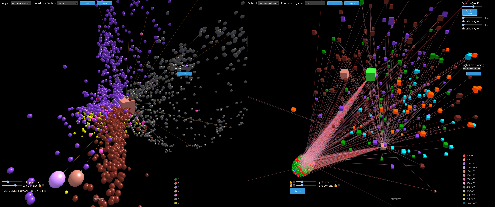
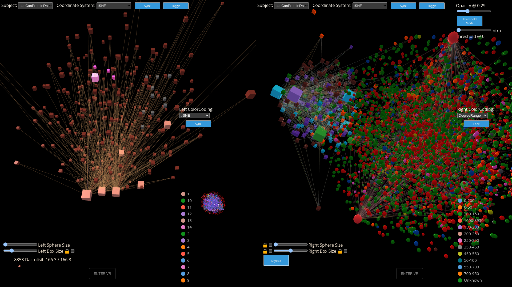
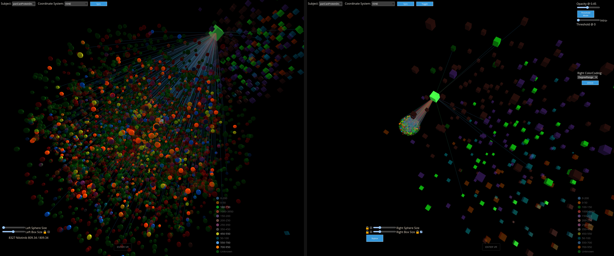

# CytoCave

CytoCave is an immersive interactive online visualization platform
based on the NeuroCave [4] connectome visualization application,
but modified and optimized for general -omics network visualization.
CytoCave leverages existing features of NeuroCave— including the
side-by-side viewports designed for freeform exploration of node-
link diagrams under various transformations or coordinate system
embeddings, as well its immersive capabilities— while adding a
range of new features that facilitate the exploration of general multi-
omics network data using dimensionality reduction projection of
high-dimensional biological data with cluster membership highlighting, 
as well as scalability upgrades to support visualizing and interacting 
with large scale proteomics and multi-omics data.

CytoCave is a work in progress, this prototype was developed for the IEEE 2023 Bio+MedVis Challenge. (http://biovis.net/2023/biovisChallenges_vis).

Live Demo of CytoCave with Bio+MedVis Challenge Data: https://src.dogstarlabs.com/morris/CytoCave/visualization.html?dataset=BioVisIEEE2023&load=0&neuro=0&lut=BioMedVis2023drugs2f

[Short Video introducing the main features of CytoCave](https://youtu.be/8x6G1FqFLNY)

For more detaila about NeuroCave, which CytoCave is based on, click here:

