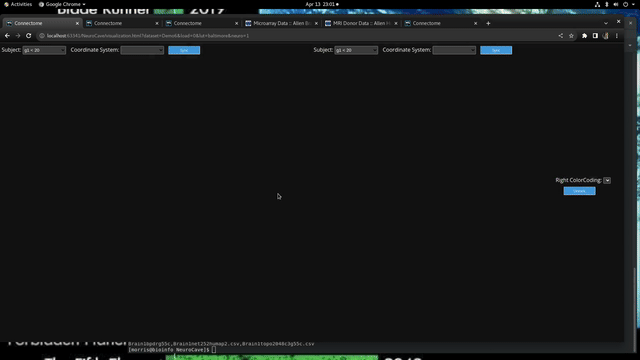
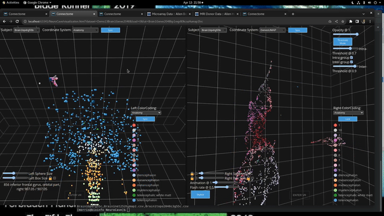
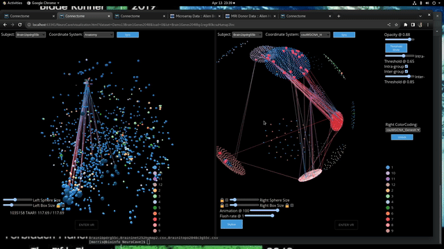

This is the NeuroCave 3D brain visualization tool demo! This tool provides a
unique and interactive way to explore brain regions and their connectivity. It is currently
undergoing a generalization transformation to allow the exploration of Neurogenomics and general genomics
datasets.

The original NeuroCave connectomics visualization tool provides a powerful means of
exploring brain connectome data with its 3D representation of brain regions as spheres
and cubes for the two hemispheres
and their connections as edges. Building on this foundation, we generalized NeuroCave to
visualize neurogenomic and genomics datasets by incorporating additional features
such as independent glyph scaling control, side-by-side window display, and independent
color coding. Here are some of the new features:
---

There are now two sets of two independent glyph size control sliders for left and right 
view windows, allowing users to adjust the size of the cube and sphere glyphs independently 
for the left and right view windows. This is particularly useful when comparing brain regions or
when focusing on a specific hemisphere
---

- Independent glyph scaling control sliders allow users to compensate for point density 
  and scale differences between two datasets simultaneously viewed in the two windows.
---

- Independent control of ipsilateral and contralateral connectivity edge display
toggle and threshold allows users to control the visibility of ipsilateral
and contralateral connectivity edges separately. Users can also set a threshold for
edge display, allowing them to focus on the most significant connections.
---

- For genomic datasets they become intragroup and intergroup connectivity edge display toggle and threshold, which
  can be adjusted to explore
  the connectivity pattern between cells, samples or brain regions and genes. For example, the threshold can be set 
  to display only
  the strongest connections between brain regions and genes, or to explore the overall connectivity pattern within
  the dataset.
---
  

-  Decoupling the color code selector in the two windows enable a few additional use cases.
   Independent control of region color visibility for left and right view window
   users can set the visibility of brain region colors separately for the left and
   right view windows. This allows them to highlight specific brain regions and their
   connectivity.
---
   

    - different color codings of the same dataset, for example, in the brain, anatomical regions can be
      color coded on the left and connection degree range can be color coded on the right, to study
      connectivity degree variations throughout a range of brain regions. Dual faceted views allow for selection
      of specific regions and their connections in each window, under one color coding, and the selection is linked
      between the two windows, visible under the other color coding, allowing for the exploration of the intersection
      of the two color codings.

   

    - displaying different colorings of genomic datasets, like gene networks, allows the user to draw
      correlations between metrics such as gene Module Membership and gene centrality

   

    - displaying different complementary datasets in each window, with linked selection and edge display,
      between them allows for intermodal exploration of networks such as brain connectome on one side and gene
      network on the other. Different color codings can be applied to each view window, each tailored to its
      own specific dataset in that window.

- The search bar can be used to locate a specific brain region or gene of interest, and its connections
    or correlated regions can be highlighted in the visualization.
---

Animation amplitude and frequency control for pulsing and flashing of selected and
connected nodes provides animation control features, allowing users to
highlight important brain regions and their connections.
Selected and connected nodes, highlighted by pulsing or flashing, are still visible
when edge lines are removed with the Opacity slider.
---

- Large-scale spatial or single-cell omics studies can also be visualized in the same way. Using a 3D tSNE embedding of
  the cells, instead of brain regions, for the 3D node positions, with cells represented as spheres, and the genes as cubes,
  both grouped based on their expression profiles, allow for the exploration of non-spacial gene expression patterns and
  cell types within the dataset.
  The independent glyph size and color coding control can be used to adjust for differences in point density and scale,
  in comparing and contrasting different aspects of the single-cell or microdissection data across different regions
  of the 3D embedding.
---

- The 3D platonic solid-based representation of clustering data can provide a means of
  exploring the hierarchical clustering of cell relationships, neuronal circuits, or
  gene networks.
---

Here are a few possible use cases for the NeuroCave 3D brain visualization tool:

- Explore the connectivity pattern of brain regions and genes in 3D space, with the ability to highlight
  lncRNA and mRNA expression patterns in the brain, alongside genes or brain regions of interest.

- Compare clustering algorithms such as csuWGCNA and regular WGCNA on the same dataset, exploring the
  differences in the clustering results and the gene modules identified by each algorithm.

- Explore the connectivity patterns of genes in 3D space, using different connectivity
  matricies, derived from different types of data, such as gene expression, protein-protein interaction,
  or KEGG pathway data.

Overall, the Neurocave 3D brain visualization tool provides a comprehensive and
  interactive platform to explore and analyze complex
neurogenomic datasets by visualizing brain regions and genes in 3D space and allowing for easy comparison and
exploration of different datasets and color codings. The decoupled control of glyph size, color coding, and
edge display controls provide users with the ability to customize the visualization to their specific
research needs while the search bar and animation controls provide a means of highlighting specific genes or
brain regions of interest.

