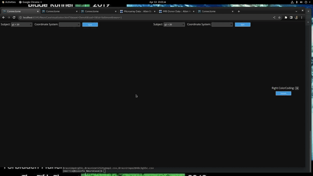
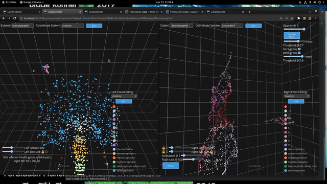
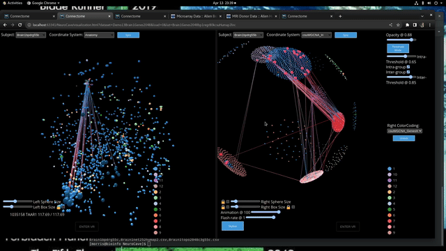

Presenting the NeuroCave 3D brain visualization tool. Originally designed for interactive exploration 
of brain regions and connectivity, here it is being transformed  to facilitate the exploration of 
Neurogenomics and general genomics datasets. The generalized version now features 
independent glyph scaling control, Independent hemisphere or other group edge display, and independent 
color coding, controllable animations, and a search box, enhancing its utility for visualizing 
neurogenomic and genomic datasets.

Key new features:

Two sets of independent glyph size control sliders for left and right view windows, allowing users to 
control sizes of cube and sphere glyphs for the left and right view windows for comparing brain 
regions or focusing on a specific hemisphere.

---

This feature allows users to compensate for point density and scale 
differences between two datasets simultaneously viewed in the two windows.

---

Separate control of ipsilateral and contralateral connectivity edge display, gives users more 
control over the edge visibility thresholds allowing them to focus on the most significant connections
or get a general sense of the connectivity patterns.

---
Intragroup and intergroup connectivity edge display toggle and threshold adjustment for examining 
connectivity patterns between cells, samples, brain regions, and genes in genomic datasets.

---
Decoupled color code selector in the two windows for various use cases, including independent control 
of region color visibility and highlighting specific brain regions and their connectivity.

- Different color codings of the same dataset, with dual faceted views allowing selection of specific 
regions and their connections in each window under one color coding, enabling the exploration of the 
intersection of the two color codings.

- Displaying different colorings of genomic datasets to draw correlations between metrics such as gene 
Module Membership and gene centrality.

- Displaying complementary datasets in each window for intermodal exploration of networks, with tailored 
color codings for each specific dataset.

---

The search bar can be used to locate specific brain regions or genes of interest and highlight their 
connections or correlated regions in the visualization.

---

Animation amplitude and frequency control for pulsing and flashing of selected and connected nodes, 
providing a means to highlight important brain regions and their connections, even when edge lines 
are be removed to reduce crossing clutter. (This is done with the opacity slider.)

---

3D platonic solid-based representation of clustering data for exploring hierarchical clustering of cell 
relationships, neuronal circuits, or gene expression patterns.

---

Here are a few possible use cases for the new version of NeuroCave:

- Exploring the connectivity pattern of brain regions and genes in 3D space, with the ability to highlight
  lncRNA and mRNA expression patterns in the brain, alongside genes or brain regions of interest.

- Visualization of large-scale spatial or single-cell omics studies, with independent glyph size 
and color coding control to adjust for differences in point density and scale when comparing and 
contrasting single-cell or microdissection data across different regions of the 3D embedding.

- Comparing clustering algorithms such as Louvain, PLACE and WGCNA on the same dataset, exploring the
  differences in the clustering results and the gene modules identified by each algorithm.

- Exploring the connectivity patterns of genes in 3D space, using different connectivity
  matricies, derived from different types of data, such as gene expression, protein-protein interaction,
  or KEGG pathway data.

---
Overall, the Neurocave 3D brain visualization tool provides a comprehensive and
interactive platform to explore and analyze complex
neurogenomic datasets by visualizing brain regions and genes in 3D space and allowing for easy comparison and
exploration of different datasets and color codings. The decoupled control of glyph size, color coding, and
edge display controls provide users with the ability to customize the visualization to their specific
research needs while the search bar and animation controls provide a means of highlighting specific genes or
brain regions of interest.